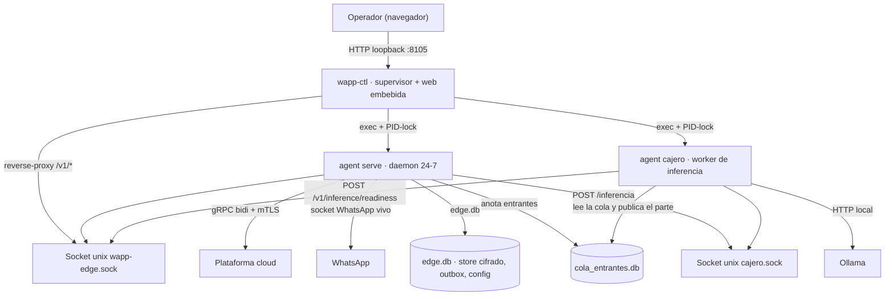
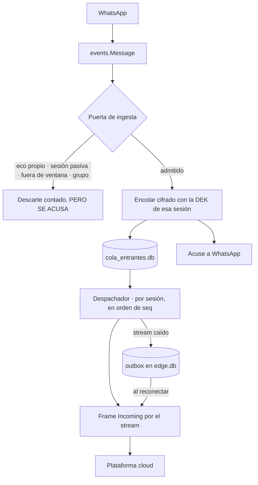
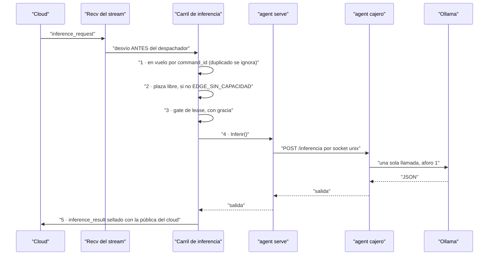

# Arquitectura de `wapp-edge-agent`

Cómo está hecha la pieza por dentro: qué procesos hay, cómo se reparten los 44 paquetes y por dónde
camina un mensaje. Los contratos concretos (rutas, frames, variables) están en
[`contratos.md`](contratos.md); las reglas que no se pueden romper, en [`constitucion.md`](constitucion.md).

---

## 1 · Tres binarios, dos empaquetados, y tres procesos vivos en campo

| Punto de entrada | Binario | Qué es | ¿Viaja al cliente? |
|---|---|---|---|
| `cmd/agent` | `agent` | El núcleo. **Tres subcomandos y no hay más**: `enroll`, `serve`, `cajero`. | **Sí** |
| `cmd/wapp-ctl` | `wapp-ctl` | El **supervisor**: arranca y para a los hijos, sirve la web embebida y hace de reverse-proxy al socket del núcleo. | **Sí** |
| `cmd/colaseed` | `colaseed` | Carga sintética sobre `cola_entrantes.db` (mismo cifrado que producción). **Deliberadamente fuera de `CMDS`** (`Makefile:35`): no se empaqueta, para que nunca llegue al equipo de un cliente. | **No** |

En una máquina en marcha hay **tres procesos**: `wapp-ctl` y sus **dos** hijos, `agent serve` y
`agent cajero`. ⚠️ Cinco comentarios del código llaman al cajero «el **tercer** hijo»
(`cmd/agent/main.go:11` entre ellos); `wapp-ctl` construye exactamente **dos** supervisores
(`cmd/wapp-ctl/main.go:91` y `:118`) y su propia documentación lo llama «SEGUNDO hijo». Cuentan mal.

---

## 2 · Las capas

Arquitectura hexagonal declarada: `domain` → `app` (casos de uso + **puertos**) → `adapters`
(implementaciones) → `infra` (cableado y plataforma).

- **`internal/domain/`** (7 ficheros, 339 líneas) está **limpio de verdad**: cero imports internos.
  Sus tipos son solo seis: `InboundEvent`, `Session`, `SessionState`, `DeviceRole`, `ReceiptEvent`,
  `ReceiptStatus`. **No existen** `SendJob`, `Lease` ni `DEK` como tipos de dominio, por mucho que
  documentación vieja los liste.
- **`internal/app/`** define los puertos (`SessionStore`, `Outbox`, `ColaEntrantes`, `ColaCajero`,
  `ColaDespachador`, `KeyCustody`, `ServidorInferencia`, `ListenGateway`, `InboundSink`…) y los casos
  de uso.
- ⚠️ **La capa `app` NO está limpia**: `internal/app/sessionmgr` importa adaptadores concretos en
  **cuatro ficheros** y **cinco líneas de import** (`pairing.go:24-25` aporta dos, `unlink.go:19`,
  `listen.go:31`, `inyector.go:24`). La regla: se cuentan **ficheros**
  (`grep -rn 'wapp-edge-agent/internal/adapters' internal/app/sessionmgr/*.go | grep -v _test | cut -d: -f1 | sort -u | wc -l`
  → 4), no líneas. Está
  censado en [`deuda.md`](deuda.md). Quien lea «hexagonal» y asuma que se puede sustituir el gateway
  de WhatsApp por otro sin tocar `app` se equivoca.

---

## 3 · Mapa de paquetes

### `internal/app/` — casos de uso

| Paquete | Una frase |
|---|---|
| `app` (raíz) | Los puertos del hexágono y los casos de uso sueltos: `Pair`, `Listen`, `Logout`, `Send` (muerto) y la definición de la cola y sus estados. |
| **`app/sessionmgr`** | 🔵 **El núcleo de verdad**: registro vivo de N sesiones, ciclo de vida completo (emparejar, restaurar, escuchar, desvincular, failover, despachador por sesión) y dueño del `Layout` de rutas en disco. |
| **`app/cajero`** | 🔵 El worker que habla con Ollama: aforo, circuito, `taskset`, servidor de inferencia y medición del prefill. |
| `app/despachador` | Drena la cola de entrantes **por sesión y en orden de `seq`** y entrega al cable. |
| `app/health` | Registro y colector del `SessionHealth` que viaja en el heartbeat. |
| `app/latencia` | Histograma del tiempo del handler `onMessage` y el latido que lo publica. |
| `app/breaker` | Circuito genérico. **No sabe qué es un fallo**: esa semántica la ponen sus llamantes (ver INV-E8). |
| `app/diagnostics` | Arma el bundle de diagnóstico bajo demanda de la nube. |

### `internal/adapters/` — implementaciones

| Paquete | Una frase |
|---|---|
| **`whatsmeow`** | 🔵 El paquete más grande: socket vivo, QR, listener 24/7, la **puerta de ingesta** con sus cuatro guardas, envío por cliente vivo e inyector de diagnóstico. |
| **`colaentrantes`** | 🔵 La cola durable de entrada sobre `cola_entrantes.db`: encolado idempotente, claim por conversación con `claim_token`, despacho, poda y el parte del worker. |
| **`cloudlink`** | 🔵 Cliente gRPC bidi + mTLS: demultiplexado de comandos, heartbeat, drenaje del outbox, **carril propio de inferencia** y relay de autenticación. |
| `control/server` | El servidor HTTP `/v1` sobre el socket unix, con el gate RBAC `edge.*`. |
| `cryptostore` | Decorador del store de `whatsmeow`: cifra **campo a campo** con AES-256-GCM bajo la DEK. |
| `supervisor` | Ciclo de vida de un proceso hijo: exec, PID-lock, SIGTERM y relanzado. |
| `keycustody` | Custodia de la DEK: Keychain / DPAPI / Secret Service / archivo `0600` (ver trampa #4 de la constitución). |
| `sessionstore` | Metadatos de negocio (`accounts`, `devices`, `sessions_v2`) sobre `edge.db`. |
| `cajerosock` | Lado **servidor** del socket unix del cajero. |
| `inferenciacliente` | Lado **cliente** del mismo socket; lo usa `agent serve`. |
| `nucleoaviso` | Cliente del aviso cajero → núcleo (`POST /v1/inference/readiness`). |
| `control/diag` | El inyector de entrantes sintéticos; su ruta solo existe con la palanca echada. |
| `control/logsink` | Ring buffer de logs y el handler SSE de `/v1/logs`. |
| `edgeconfig` | Aplica la configuración que la nube empuja (`ConfigUpdate`), con last-known-good. |
| `outbox` | Outbox durable sobre `edge.db`; se drena al reconectar. |
| `control` (raíz) | Render del QR: terminal ASCII, PNG y en memoria. |
| `intent` | **Solo** sirve `GET /v1/intent/status`. El decorador que clasificaba en línea se retiró. |
| `control/enrolladapter` · `control/inventory` | Adaptadores finos del plano de control. |

### `internal/infra/` — cableado y plataforma

| Paquete | Una frase |
|---|---|
| `config` | Defaults + YAML + overlay de entorno con **dos prefijos** (`WAPP_AGENT_` y `WAPP_WORKER_`) y los avisos de variables retiradas. |
| `db` | Apertura con dos perfiles de PRAGMA, migraciones embebidas y las cuatro funciones `ensure…`. |
| `wiring` | Los constructores (`BuildMux`, `BuildOutbox`, `BuildCola`, `BuildIntent`, `BuildAuthManager`, `dialCloudLink`…). |
| `daemon` | El orquestador de `agent serve`. |
| `edgemigrate` | Migraciones *clean-slate* del layout en disco y restauración de sesiones activas. |
| `enroll` | Cliente real de enrolamiento: genera el CSR, canjea el código y persiste el material mTLS. |
| `logger` · `watchdog` | Logger (respeta `WAPP_LOG_FILE`) y el «abandona y reporta» para llamadas cgo que pueden colgarse. |
| `deps` | 🔴 **Paquete muerto**: 16 líneas de blank-imports sin un solo importador. Ver [`deuda.md`](deuda.md). |
| `internal/auth` | Identidad del **operador** del plano de control: JWKS, relay a la nube, ventana de gracia y custodia del refresh. |
| `internal/webui` | Los cuatro assets embebidos y la constante del aviso de sesión pasiva. |
| `packaging/macos` | Render del LaunchAgent (el resto de `packaging/` son scripts, no Go). |

---

## 4 · El camino de un mensaje entrante

El listener **no interpreta y no espera**: anota en la cola y suelta el hilo. Quien entrega es el
despachador, en orden de `seq` **dentro de cada sesión**.

Dos cosas que este dibujo esconde y conviene decir:

- **El acuse a WhatsApp está atado a que la fila quede escrita.** Lo que deja fila **siempre** acusa;
  un `INSERT` que falla **no** acusa. Hay diez tests que vigilan exactamente ese emparejamiento
  (`internal/adapters/whatsmeow/listener_acuse_test.go`), porque `whatsmeow` acusa **después** del
  handler y el handler devuelve `true` siempre.
- **Los descartes deliberados SÍ acusan**: descartar no es fallar.

---

## 5 · El camino de una inferencia

El Cloud manda el prompt ya construido; el Edge lo sirve. La petición **no pasa por el
despachador-por-sesión**, y eso es deliberado: el deadline de 30 s de aquel no cabe (una inferencia
legítima llega a 36 s medidos y el techo del Edge son 120 s), y como el `session_id` de una
inferencia viene vacío por contrato, **todas** caerían en la misma cola en fila india. Está escrito
al completo en la cabecera de `internal/adapters/cloudlink/inferencia.go`.

---

## 6 · Dónde vive cada cosa en disco

Todo cuelga de `<data_dir>` (por defecto `~/Library/Application Support/wApp/edge` en macOS,
`~/.config/wApp/edge` en Linux, `%AppData%\wApp\edge` en Windows), creado con `MkdirAll 0700`. La
lista completa, con qué escribe cada fichero, está en [`contratos.md`](contratos.md).

Lo estructural: **dos bases SQLite** (nunca una), **un socket unix por proceso servidor**
(`wapp-edge.sock` del núcleo y `cajero.sock` del cajero), y **una DEK por sesión**, fuera del árbol
del store para que la custodia pueda migrar al keystore del SO sin mover rutas de store.
